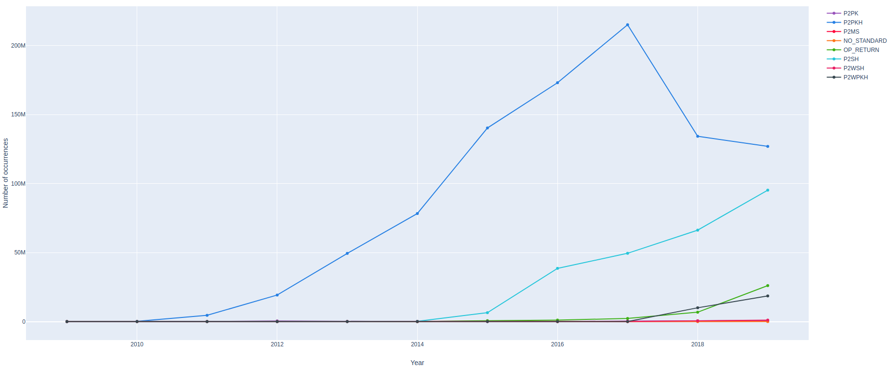

# <p align=center> :mortar_board: SpyCBlock :microscope: </p>

SpyCBlock is an accademics software that analyses the blk file of Bitcoin blockchain Mainet.
This is an explerimental version and it wants  to demostrate that it is possible to work with only file blk.

SpyCBlock is a simple parser bitcoin blk file, with this parser it is possible to do some serialization, like:

- Serialization Transaction Graph (:heavy_check_mark:);
- Serialization complete Blockchain to JSON (:heavy_check_mark:);
- Serialization Address Graph (:warning:).


To reduce the space of serialization Transaction graph, it is possible to use the library [ZLib](https://github.com/madler/zlib) to compress the information; with this code it is possible to uncompress the data.

```c++
void decompressFileWithZLib()
{
    std::string filename = "YOUR_PATH/blkXXXXX.dat";
    gzFile inFileZ = gzopen(filename.c_str(), "rb");

    if(inFileZ == NULL){
        printf("Error: Failed to gzopen %s\n", filename.c_str());
        exit(0);
    }
    unsigned char unzipBuffer[8192];
    unsigned int unzippedBytes;
    std::vector<unsigned char> unzippedData;
    while (true)
    {
        unzippedBytes = gzread(inFileZ, unzipBuffer, 8192);
        if(unzippedBytes > 0) {
            unzippedData.insert(unzippedData.end(), unzipBuffer, unzipBuffer + unzippedBytes);
        }else{
            break;
        }
    }

    for(auto &character : unzippedData)
    {
        if(character == '.'){
            std::cout << "\n";
        }else{
            std::cout << character;
        }
    }
}
```

It Is possible to execute the parser with the library [OpenMP](https://www.openmp.org/) for execution data with multi-core and this is a simple velocity benchmark.

_PS: at the moment the parser uses all core of the CPU is the multicore propriety is enabled._


The graph of transactions form is describe [here](#todo) and this is an example to visualise this with Web app, [this is](https://github.com/vincenzopalazzo/SpyJSBlock.react) a simple demo.

_The screenshot of transaction graph_


_The screenshot of address graph subdivise to class (with luvain algorithm)_


## JSON version Bitcoin Blockchain

Having the version of Bitcoin blockchain to JSON is powerful because it is possible to work on the JSON format, With this is possible to create easy analysis on Bitcoin network.

An example: I created a simple analysis with [AnalytcsPyBlock](https://github.com/vincenzopalazzo/AnalyticsPyBlock) to get informations from type of script used in the Bitcoin blockchain; this is the result and [here](https://vincenzopalazzo.github.io/AnalyticsPyBlock/) is avaible the web version.



## IRC channels

- IRC dev channel: _#spycblock-dev_